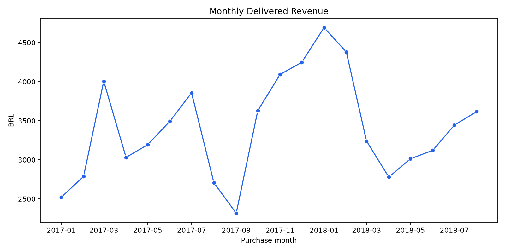
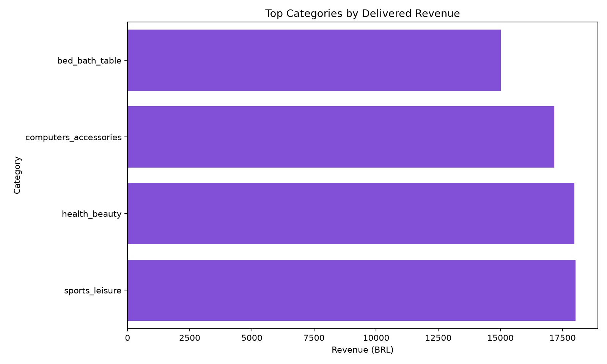
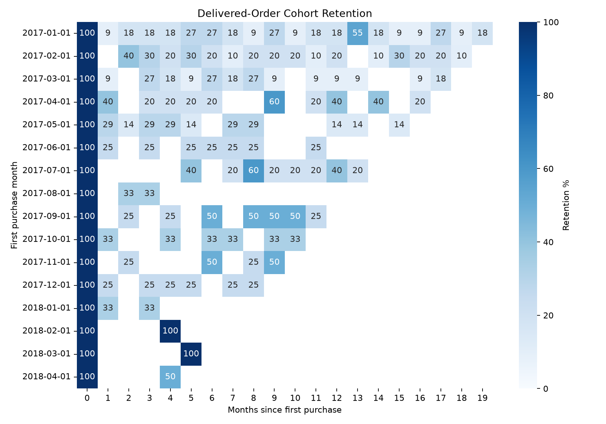

# E-Commerce Product Analytics

[](https://www.python.org/) [](https://www.sqlite.org/) [](#design-decisions)

An end-to-end product analytics case study using Olist's relational Brazilian e-commerce data. It turns normalized marketplace records into defensible revenue, customer-repeat, product, and cohort-retention metrics—answering which products create value, whether customers return, and how those patterns should shape growth priorities.

## Business question

What is driving delivered-order revenue over time, which categories contribute the most value, and how effectively does the marketplace bring customers back after their first purchase? These answers help a product or commercial team distinguish acquisition-led growth from durable customer value and focus merchandising or lifecycle investment accordingly.

## Key metrics & definitions

| Metric | Definition |
|---|---|
| Revenue | Sum of item price + freight for **delivered** orders only. |
| AOV | Mean recognized revenue per delivered order (not per item). |
| Repeat purchase rate | Customers with 2+ delivered orders ÷ customers with at least 1 delivered order. It is not time-windowed. |
| Cohort retention | Share of customers in a first-delivered-purchase-month cohort that placed a delivered order in each later calendar month. |

Cancelled and unavailable orders remain in the database for operational analysis but are excluded from revenue and retention. This avoids treating unfulfilled orders as realized commercial value; it is a conservative and interview-defensible recognition policy.

## Visual output

The committed charts are generated from the reproducible offline sample. Re-run against the real Olist data to refresh them.







## Key findings & recommendations

These observations are intentionally based on the included synthetic demo; replace them with outputs from the Olist download before presenting them as market findings.

- Revenue and AOV can move independently, so monitor both weekly: pair any revenue acceleration with an AOV check to tell whether it is basket expansion or simply more orders.
- Category concentration should guide merchandising: prioritize the top-revenue categories for search, inventory, and seller experience, while testing whether lower-revenue categories add incremental basket value.
- Repeat-rate and cohort views expose a common gap between acquisition and retention: if later cohort columns fade quickly, trigger post-delivery replenishment or cross-sell journeys rather than increasing acquisition spend alone.
- The customer-order sequence and running-revenue query identifies high-value repeaters directly in SQL; use it to define lifecycle segments and investigate the product paths that precede second orders.

## Project structure

```
data/                    download guide; raw source is gitignored
sql/                     documented, executable metric queries
src/                     loading, cleaning, query execution, charting
notebooks/analysis.ipynb narrative walkthrough with rendered outputs
reports/figures/         generated PNGs and standalone interactive HTML
```

## How to run

```bash
python -m venv .venv && source .venv/bin/activate
pip install -r requirements.txt

# Choose one data source
python -m src.generate_sample_data  # offline illustrative data
# Or follow data/download_instructions.md for Kaggle and place CSVs in data/raw

python -m src.load_data
python -m src.clean_data
python -m src.run_queries
python -m src.visualize
jupyter notebook notebooks/analysis.ipynb
```

`run_queries.py` executes the `.sql` assets against SQLite and writes query tables to `reports/query_outputs/`. The raw tables are kept normalized in SQLite; Python's joined order-line fact table is reserved for cleaning and downstream exploration.

## Design decisions

- **SQLite:** a portable, inspectable relational layer that demonstrates joins, aggregations, CTEs, and window functions without requiring infrastructure.
- **Revenue policy:** only delivered orders are recognized; canceled/unavailable records are preserved, but fulfillment did not occur.
- **Window functions:** `ROW_NUMBER()` and cumulative `SUM() OVER()` calculate ordered customer behavior in the database, avoiding fragile reimplementation in pandas.
- **Scope:** descriptive and exploratory analytics only. No claims of causal impact, A/B testing, statistical significance, or predictive modeling are made.

## Data source

Olist Brazilian E-Commerce Public Dataset on Kaggle. Source CSVs are not included in this repository; see [download instructions](data/download_instructions.md).
